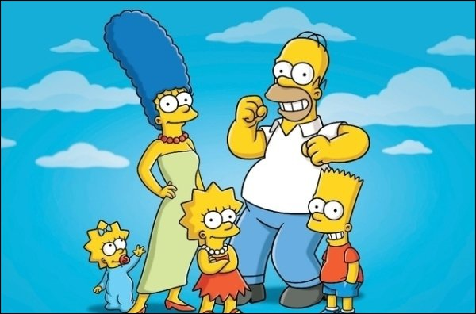
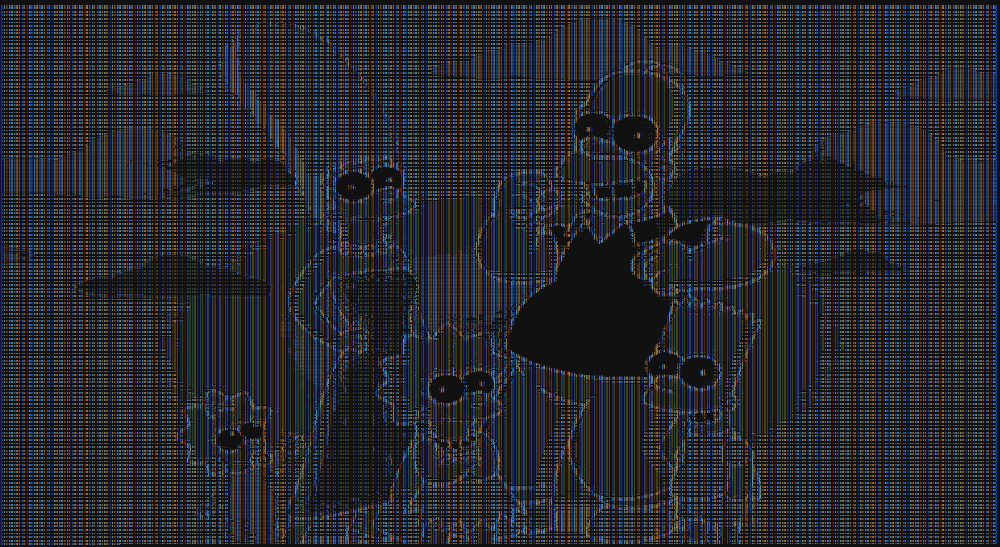
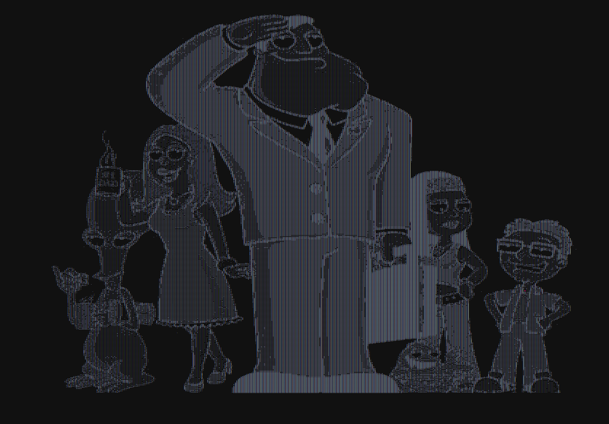

# Scalascii
A simple tool which converts any image into an ascii one. 

# Examples:

## Before :
<h1 align='center'>

</h1>

## After :
<h1 align='center'>

</h1>

## Before :
<h1 align='center'>

</h1>

## After :
<h1 align='center'>

</h1>
